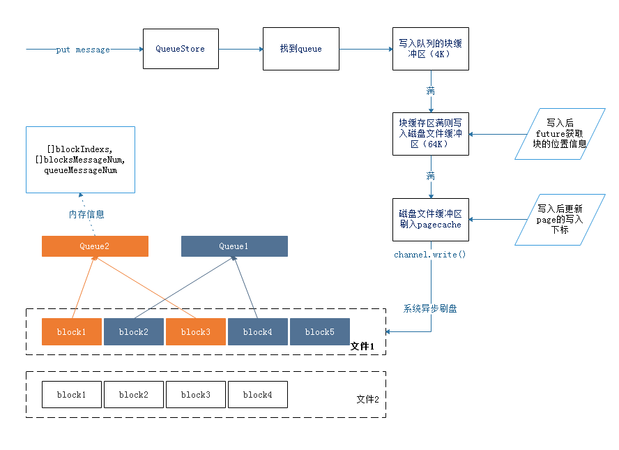

## 单机百万队列

## io选型
我们知道，Java 世界有很多 MQ：ActiveMQ，kafka，RocketMQ，去哪儿 MQ
，他们则是 Java 世界使用 NIO 零拷贝的大户。

然而，他们的性能却大相同，抛开其他的因素，例如网络传输方式，
数据结构设计，文件存储方式，我们仅仅讨论 Broker 端对文件的读写，看看
有什么不同。
下图是楼主查看源码总结的各个 MQ 使用的文件读写方式。

- kafka：record 的读写都是基于 FileChannel。

  index 读写基于 MMAP。

- RocketMQ：读盘基于 MMAP，写盘默认使用 MMAP。

   可通过修改配置，配置成 FileChannel，原因是作者想避免 
   PageCache 的锁竞争，通过两层实现读写分离。

- QMQ： 去哪儿 MQ，读盘使用 MMAP，写盘使用 FileChannel。

| MQ            | 读            | 写           |
| ------------  |:-------------:| ------------:|
| kafka         | FileChannel   | FileChannel  |
| rockectMq     | MMAP          | MMAP、FileChannel|
| QMQ           | MMAP          | FileChannel  |

MMAP 众所周知，基于 OS 的 mmap 的内存映射技术，通过 MMU 映射文件，
使随机读写文件和读写内存相似的速度。
那 FileChannel 呢？是零拷贝吗？
很遗憾，不是。FileChannel 快，只是因为他是基于 block 的。

总结下网上测试结果，得出的图片  

| 数据包大小 | 读            | 普通写  | force写 |
| ------------  |:-------------:|:------------:|:-----:|
| 小于4K         | mmap   |   |
| 大于4K     | FileChannel          | 
| 大于64byte    |          | FileChannel  |FileChannel  |
| 小于64byte    |           | mmap  |FileChannel  |  

假设，我们的系统的数据包在 1024 - 2048 左右，我们应该使用什么策略？  
答：读使用 mmap，仅仅写使用 FileChannel。
再回过头看看 MQ 的实现者们，似乎只有 QMQ 是 这么做的。  
当然，RocketMQ 也提供了 FileChannel 的写选项。但默认 mmap 写加异步刷盘，应该是 broker busy 的元凶吧。  
而 Kafka，因为默认不 force，也是使用 FileChannel 进行写入的，为什么使用 FileChannel 读呢？大概是因为消息的大小在 4kb 以上吧。
这样一揣测，这些 MQ 的设计似乎都非常合理。
最后，能不用 force 就别用 force。如果要用 force ，就请使用 FileChannel。

## 存储设计
消息中间件的高性能点在于顺序读写，pageCache的充分利用

**kafka**: 以topic分区  
&ensp;&ensp;&ensp;&ensp;&ensp;&ensp;每个topic以partition为存储单位  
&ensp;&ensp;&ensp;&ensp;&ensp;&ensp;partition下再细分segment  
&ensp;&ensp;&ensp;&ensp;&ensp;&ensp;每个segment下存储三个文件：[文件都以offset作为文件名，方便二分查找]  
&ensp;&ensp;&ensp;&ensp;&ensp;&ensp;&ensp;- index索引文件  
&ensp;&ensp;&ensp;&ensp;&ensp;&ensp;&ensp;- 时间戳index索引文件  
&ensp;&ensp;&ensp;&ensp;&ensp;&ensp;&ensp;- 实际存储数据的log文件

索引文件的结构是一个map，key是当前segment的offset的偏移量,从0开始。
value是对应的log文件中消息开始位置的实际物理位置偏移量。
索引文index file采取稀疏索引存储方式，它减少索引文件大小，
通过mmap可以直接内存操作，
稀疏索引为数据文件的每个对应message设置一个元数据指针,
它比稠密索引节省了更多的存储空间，
但查找起来需要消耗更多的时间。

举个🌰，消息的查找过程，比如offset的值是368772，如何查找消费对应消息内容。  
> 1.根据offset找到所在的segment，根据二分查找，  
找到消息所在的log文件0000000000000368769.log和索引文件0000000000000368769.index  
2.计算下差368772-368769=3，在索引文件中也是二分查找,
定位到是<3,497>记录，即对应的物理位置是497，从而找到消息  
3.根据物理位置497在0000000000000368769.log文件找到消息。

**dzz-fqueue**  
因为是设计支持单机百万队列，不能直接照搬kafka和rocketMq的设计  
首先，百万队列的情况下同一个队列的消息应该尽量放入在一块区域，如果还是和kafka或rokectMq一样消息顺序写入  

百万队列可以对应的是lot场景

## 写入流程

## 读取流程