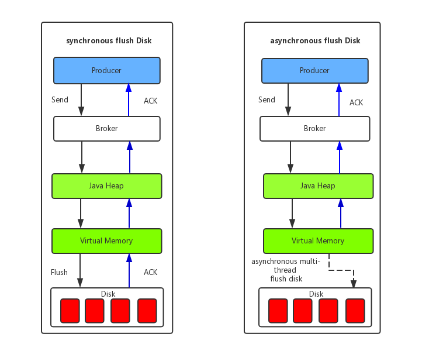

## rocket mq 存储机制
首先，rocket和kafka一样是基于文件存储的。消息是顺序写入，充分利用page cache,写入性能很高。
但是这样对于topic来说，存储的消息数据可能是不连续的。

这样需要对不同topic或者queue进行索引或者分区。这样就至少需要两个文件：
一个文件存储真实数据，一个文件存储消息索引。

于是rocket mq有以下文件：
- **commitlog**: 真实消息记录目录
    
    commitlog文件的存储地址：$HOME\store\commitlog\${fileName}，每个文件的大小默认1G =102410241024。因为是
    利用javaNio 的**MappedByteBuffer**来提高读写性能，减少io拷贝。而java的MappedByteBuffer默认映射限制是1G左右。
    CommitLog的文件名fileName，名字长度为20位，左边补0，剩余为起始偏移量。
    比如 00000000000000000000 代表了第一个文件，起始偏移量为 0， 文件大小为 1G=1073741824；
    **写入的消息是不定长的**，当这个文件满了，开始写第二个文件，第二个文件名字为 00000000001073741824。
    
- **index**: 消息索引文件存储目录
    
    
    Index文件的目的是能快速定位查询出消息，是为随机查询消息服务的，比如在管理端查询消息等，和consume queue没有直接联系的。
    Index文件的存储位置是：$HOME \store\index\${fileName}，文件名fileName是以创建时的时间戳命名的，文件大小是固定的。
    是通过消息Key值查询消息真正的实体内容。
    
    分为以下几个部分：
    - IndexHead 数据：40字节
        - beginTimestamp：该索引文件包含消息的最小存储时间 
        - endTimestamp：该索引文件包含消息的最大存储时间 
        - beginPhyoffset：该索引文件中包含消息的最小物理偏移量（commitlog 文件偏移量） 
        - endPhyoffset：该索引文件中包含消息的最大物理偏移量（commitlog 文件偏移量） 
        - hashSlotCount：hashslot个数，并不是 hash 槽使用的个数，在这里意义不大 
        - indexCount：已使用的 Index 条目个数
        
    - Hash 槽：4字节
        一个 IndexFile 默认包含 500W 个 Hash 槽，每个 Hash 槽存储的是落在该 Hash 槽的 hashcode 最新的 Index 的索引
    
    - Index 条目列表: 20字节 默认可以存储2000w条
        - hashcode：key 的 hashcode 
        - phyoffset，消息对应的物理偏移量
        - timedif：该消息存储时间与第一条消息的时间戳的差值，小于 0 表示该消息无效 
        - preIndexNo：该条目的前一条记录的 Index 索引，hash 冲突时，根据该值构建链表结构
    
    index文件约=40+ (4 * 500w)+ (2000W * 20)=400M左右
    索引查询过程：
    1. 根据查询的 key 的 hashcode%slotNum 得到具体的槽的位置（ slotNum 是一个索引文件里面包含的最大槽的数目，例如图中所示 slotNum=5000000）。
    2. 根据 slotValue（ slot 位置对应的值）查找到索引项列表的最后一项（倒序排列， slotValue 总是指向最新的一个 索引项）。
    3. 遍历索引项列表返回查询时间范围内的结果集（默认一次最大返回的 32 条记彔）
    
    查找消息示例： key->hash(key)->slot位置->index条目->phyoffset->找到log
    1. 消息对应slotPos=Math.abs(keyHash)%hashSlotNum，
    2. 消息在IndexFile中的偏移量absSlotPos = IndexHeader.INDEX_HEADER_SIZE + slotPos *HASH_SLOT_SIZE = 40+slotPos *40
    3. 很快定位到某一个消息在IndexLinkedList中的位置
    Hash 冲突；寻找 key 的 slot 位置时相当于执行了两次散列函数，一次 key 的 hash，一次 key 的 hash 值取模。
    
    因此返里存在两次冲突的情况；
    - 第一种， key 的 hash 不同但模数相同，此时查询的时候会在比较一次key 的hash 值（每个索引项保存了 key 的 hash 值），过滤掉 hash 值不相等的项。
    - 第二种， hash 值相等但 key 不等，出于性能的考虑冲突的检测放到客户端处理（ key 的原始值是存储在消息文件中的，避免对数据文件的解析），客户端比较一次消息体的 key 是否相同
    
- **consumer queue**

    RocketMQ基于主题订阅模式实现消息的消费，消费者关心的是主题下的所有消息。
    但是由于不同的主题的消息不连续的存储在commitlog文件中，如果只是检索该消息文件可想而知会有多慢，为了提高效率，对应的主题的队列建立了索引文件。
    目录位置：$HOME\store\consumerqueue\{topicName}\
    
    为了加快消息的检索和节省磁盘空间，每一个consumequeue条目20个字节,包含以下信息：
    - 消息在commitog文件中的偏移量 8字节
    - 消息长度 4字节
    - tag的hashcode值 8字节
    
    单个consumequeue文件中默认包含30万个条目，每个条目，所以每个文件的大小是固定的20w x 20字节，大概5.76m.
    consumer queue文件较小，不大需要mmap,读写应该是file channel ,java nio的方式。
    单个consumequeue文件可认为是一个数组，下标即为逻辑偏移量，消息的消费进度存储的偏移量即逻辑偏移量。
    
- checkpoint
    checkpoint文件的作用是记录commitlog、consumequeue、index文件的刷盘时间点，文件固定长度4k,其中只用了该文件的前24个字节。查看其存储格式
    - physicMsgTimestamp：commitlog文件刷盘时间点
    - logicsMsgTimestamp：消息的消费队列文件刷盘时间点
    - indexMsgTimestamp：索引文件刷盘时间点
    
- abort：如果存在abort文件说明Broker非正常关闭，该文件默认启动时创建，正常退出时删除
    
    
## 存储结构分析
ConsumeQueue逻辑消费队列存储的数据较少，并且是顺序读取，在page cache机制的预读取作用下，Consume Queue文件的读性能几乎接近读内存，即使在有消息堆积情况下也不会影响性能。

而对于CommitLog消息存储的日志数据文件来说，读取消息内容时会产生较多的随机访问读取，严重影响性能。

如果选择合适的系统IO调度算法，比如设置调度算法为“Deadline”（此时块存储采用SSD的话），随机读的性能也会有所提升。

另外，RocketMQ主要通过MappedByteBuffer对文件进行读写操作。
其中，利用了NIO中的FileChannel模型将磁盘上的物理文件直接映射到用户态的内存地址中
（这种Mmap的方式减少了传统IO将磁盘文件数据在操作系统内核地址空间的缓冲区和用户应用程序地址空间的缓冲区之间来回进行拷贝的性能开销），
将对文件的操作转化为直接对内存地址进行操作，从而极大地提高了文件的读写效率
（正因为需要使用内存映射机制，故RocketMQ的文件存储都使用定长结构来存储，方便一次将整个文件映射至内存）。

## 消息刷盘方式
   
- **同步刷盘**：
    如上图所示，当消息真正持久化至磁盘后，RocketMQ的Broker端才会真正返回给Producer端一个成功的ACK响应。
    同步刷盘对MQ消息可靠性来说是一种不错的保障，但是性能上会有较大影响，一般适用于金融业务应用。
- **异步刷盘**：能够充分利用OS的PageCache的优势，只要消息写入PageCache即可将成功的ACK返回给Producer端。
    消息刷盘采用后台异步线程提交的方式进行，降低了读写延迟，提高了MQ的性能和吞吐量。

### rocket 消息记录格式

|编号|字段简称|字段大小（字节）|字段含义|
|----|----|----|----|
|1|msgSize|4|代表这个消息的大小|
|2|MAGICCODE|4|MAGICCODE = daa320a7|
|3|BODY CRC|4|消息体BODY CRC 当broker重启recover时会校验|
|4|queueId|4||
|5|flag|4||
|6|QUEUEOFFSET|8|这个值是个自增值不是真正的consume queue的偏移量，可以代表这个consumeQueue队列或者tranStateTable队列中消息的个数，若是非事务消息或者commit事务消息，可以通过这个值查找到consumeQueue中数据，QUEUEOFFSET * 20才是偏移地址；若是PREPARED或者Rollback事务，则可以通过该值从tranStateTable中查找数据|
|7|PHYSICALOFFSET|8|代表消息在commitLog中的物理起始地址偏移量|
|8|SYSFLAG|4|指明消息是事物事物状态等消息特征，二进制为四个字节从右往左数：当4个字节均为0（值为0）时表示非事务消息；当第1个字节为1（值为1）时表示表示消息是压缩的（Compressed）；当第2个字节为1（值为2）表示多消息（MultiTags）；当第3个字节为1（值为4）时表示prepared消息；当第4个字节为1（值为8）时表示commit消息；当第3/4个字节均为1时（值为12）时表示rollback消息；当第3/4个字节均为0时表示非事务消息|
|9|BORNTIMESTAMP|8|消息产生端(producer)的时间戳|
|10|BORNHOST|8|消息产生端(producer)地址(address:port)|
|11|STORETIMESTAMP|8|消息在broker存储时间|
|12|STOREHOSTADDRESS|8|消息存储到broker的地址(address:port)|
|13|RECONSUMETIMES|8|消息被某个订阅组重新消费了几次（订阅组之间独立计数）,因为重试消息发送到了topic名字为%retry%groupName的队列queueId=0的队列中去了，成功消费一次记录为0|
|14|PreparedTransaction Offset|8|表示是prepared状态的事物消息|
|15|messagebodyLength|4|消息体大小值|
|16|messagebody|bodyLength|消息体内容|
|17|topicLength|1|topic名称内容大小|
|18|topic|topicLength|topic的内容值|
|19|propertiesLength|2|属性值大小|
|20|properties|propertiesLength|propertiesLength大小的属性数据|