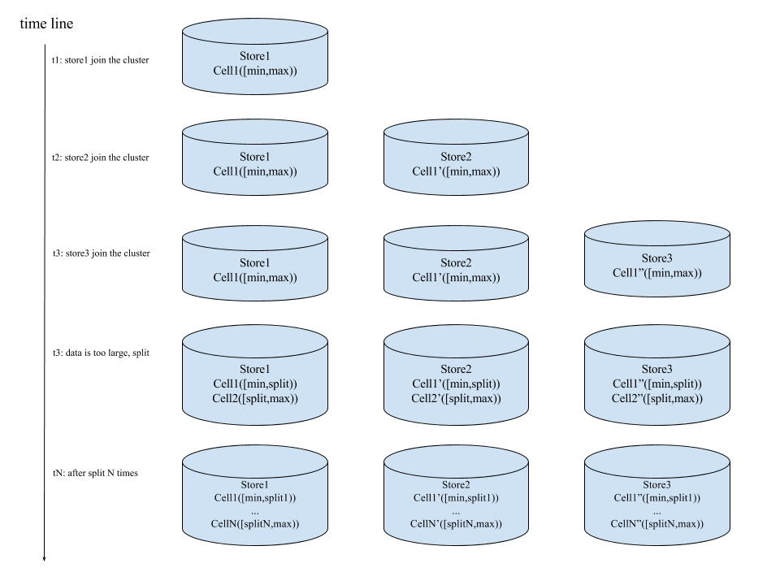

#### 单raft group 的问题
数据量大的时候，单个Raft实例负载太高，为了提高整体吞吐，往往将数据分为多个片，
每个片由独立的Raft Group来管理。会有一个类似于元数据服务器的东西来管理所有的Raft Group，
负责数据的分片，Group间的负载均衡等.

http://github.com/deepfabric/elasticell
难点引用Elasticell-Multi-Raft实现这篇文章提到的：
1. 数据何如分片
2. 分片中的数据越来越大，需要分裂产生更多的分片，组成更多Raft-Group
3. 分片的调度，让负载在系统中更平均（分片副本的迁移，补全，Leader切换等等）
4. 一个节点上，所有的Raft-Group复用链接（否则Raft副本之间两两建链，链接爆炸了）
5. 如何处理stale的请求（例如Proposal和Apply的时候，当前的副本不是Leader、分裂了、被销毁了等等）
6. Snapshot如何管理（限制Snapshot，避免带宽、CPU、IO资源被过度占用）

具体可以参考上面这篇文章看看他们是怎么解决这些问题的

-------------------
文章

简单来说，Multi-Raft是在整个系统中，把所管理的数据按照一定的方式切片，每一个切片的数据都有自己的副本，
这些副本之间的数据使用Raft来保证数据的一致性，在全局来看整个系统中同时存在多个Raft-Group，就像这个样子：

延伸阅读:

基于 Raft 构建弹性伸缩的存储系统的一些实践 https://pingcap.com/blog-cn/building-distributed-db-with-raft/
Cockroach design  https://github.com/cockroachdb/cockroach/blob/master/docs/design.md

### 技术选型
2017年初，我们刚开始做Elasticell的时候，开源的Multi-Raft实现很少，当时我们知道开源的实现有Cockroach和TiDB
（二者都是受Google的Spanner和F1的启发）。Cockroach是Go语言实现，TiDB是Rust实现，
Raft基础库都是使用Etcd的实现（TiDB是把Etcd的Raft移植到了Rust上）。

两者在架构上一个很重要的不同是TiDB是一个分离式的设计，整个架构上有PD、TiDB、TiKV三个。
我们当时觉得元信息使用PD独立出来管理，架构更清晰，工程实现也相对简单，所以我们决定参照TiDB来实现Multi-Raft。

Elasticell参考的是2017年3月份左右的TiDB的版本，大体思路基本一致，实现方式上有一些不一样的地方，更多的是语言的差异。
TiDB的实现是Rust的实现，Elasticell是pure Go的实现。

### CGO和GC的开销问题
在我们决定用Go开发Elasticell的时候，就有些担心CGO和GC的开销问题，当时还咨询了PingCAP的黄东旭，
最后认为在KV场景下，这个开销应该可以接受。
后来开发完成后，我们做了一些常见的优化（合并一些CGO调用，使用对象池，内存池等），
发现**系统的瓶颈基本在IO**上，目前CGO和GC的开销是可以接受的。

### Elasticell实现细节-数据如何分片
Elasticell支持两种分片方式适用于不同的场景
1. 按照用户的Key做字典序，系统一开始只有1个分片，分片个数随着系统的数据量逐渐增大而不断分裂（这个实现和TiKV一致）
2. 按照Key的hash值，映射到一个uint64的范围，可以初始化的时候就可以设置N个分片，让系统一开始就可以支持较高的并发，后续随着数据量的增大继续分裂

### Elasticell实现细节-分片如何调度
这部分的思路就和TiKV完全一致了。

PD负责调度指令的下发，PD通过心跳收集调度需要的数据，这些数据包括：
- 节点上的分片的个数
- 分片中leader的个数
- 节点的存储空间
- 剩余存储空间等等。

一些最基本的调度：
1. PD发现分片的副本数目缺少了，寻找一个合适的节点，把副本补全
2. PD发现系统中节点之间的分片数相差较多，就会转移一些分片的副本，保持系统中所有节点的分片数目大致相同（存储均衡）
3. PD发现系统中节点之间分片的Leader数目不太一致，就会转移一些副本的Leader，保持系统中所有节点的分片副本的Leader数目大致相同（读写请求均衡）

调度的过程可以从两幅图上直观的感受出来

延伸阅读：
三篇文章了解 TiDB 技术内幕 —— 谈调度 http://mp.weixin.qq.com/s/qhWlnzz8bXhIeGZauPo8gQ
TiKV 源码解析系列 - PD Scheduler  http%://mp.weixin.qq.com/s/NDzWrHH_0gTKb7xuK33oSw

### Elasticell实现细节-新的分片如何形成Raft-Group
作者：fagongzi
链接：https://zhuanlan.zhihu.com/p/33047950
来源：知乎
著作权归作者所有。商业转载请联系作者获得授权，非商业转载请注明出处。

假设这个分片1有三个副本分别运行在N1,N2,N3三台机器上，其中N1机器上的副本是Leader，分片的大小限制是1GB。

当分片1管理的数据量超过1GB的时候，分片1就会分裂成2个分片，分裂后进行以下流程
1. 分片1修改数据范围，更新Epoch，继续服务。
2. 分片2形也有三个副本，分别也在N1，N2，N3上，这些是元信息。
   但是只有在N1上存在真正被创建的副本实例，N2，N3并不知道这个信息。
3. 这个时候N1上的副本会立即进行Campaign Leader的操作，
    这个时候，N2和N3会收到来自分片2的Vote的Raft消息，N2，N3发现分片2在自己的节点上并没有副本，
    那么就会检查这个消息的合法性和正确性，通过后，立即创建分片2的副本，刚创建的副本没有任何数据，
    创建完成后会响应这个Vote消息，也一定会选择N1的副本为Leader。
4. 选举完成后，N1的分片2的Leader会给N2，N3的副本直接发送Snapshot，

最终这个新的Raft-Group形成并且对外服务。按照Raft的协议，分片2在N1副本称为Leader后不应该直接给N2，N3发送snapshot，
但是这里我们沿用了TiKV的设计，Raft初始化的Log Index是5，那么按照Raft协议，N1上的副本需要给N2，N3发送AppendEntries，
这个时候N1上的副本发现Log Index小于5的Raft Log不存在，所以就会转为直接发送Snapshot。

### Elasticell实现细节-如何处理stale的请求
由于分片的副本会被调度（转移，销毁），分片自身也会分裂（分裂后分片所管理的数据范围发生了变化），
所以在Raft的Proposal和Apply的时候，我们需要检查Stale请求，如何做呢？其实还是蛮简单的，TiKV使用Epoch的概念，
我们沿用了下来。
一个分片的副本有2个Epoch:
- 一个在分片的副本成员发生变化的时候递增
- 一个在分片数据范围发生变化的时候递增

在请求到来的时候记录当前的Epoch，在Proposal和Apply的阶段检查Epoch，让客户端重试Stale的请求。

### Elasticell实现细节-Snapshot如何管理
我们的底层存储引擎使用的是RocksDB，这是一个LSM的实现，支持对一个范围的数据进行Snapshot和Apply Snapshot，我们基于这个特性来做。

Raft中有一个RPC用于发送Snapshot数据，但是如果把所有的数据放在这个RPC里面，那么会有很多问题：
- 一个RPC的数据量太大（取决于一个分片管理的数据，可能上GB，内存吃不消）
- 如果失败，整体重试代价太大难以流控

我们修改为这样：
- Raft的snapshot RPC中的数据存放snapshot文件的元信息（包括分片的ID，当前Raft的Term，Index，Epoch等信息）
- 发送Raft snapshot的RPC后，异步发送具体
- 数据文件数据文件分Chunk发送，重试的代价小
- 发送 Chunk的链接和Raft RPC的链接不复用
- 限制并行发送的Chunk个数，避免snapshot文件发送影响正常的Raft RPC
- 接收Raft snapshot的分片副本阻塞，直到接收完毕完整的snapshot数据文件

后续文章
我们在Raft上做的一些优化
如何支持全文索引
敬请期待

感谢
PingCAP团队(健壮的Multi-Raft实现)
@Ed Huang
 (私下咨询了很多问题)

