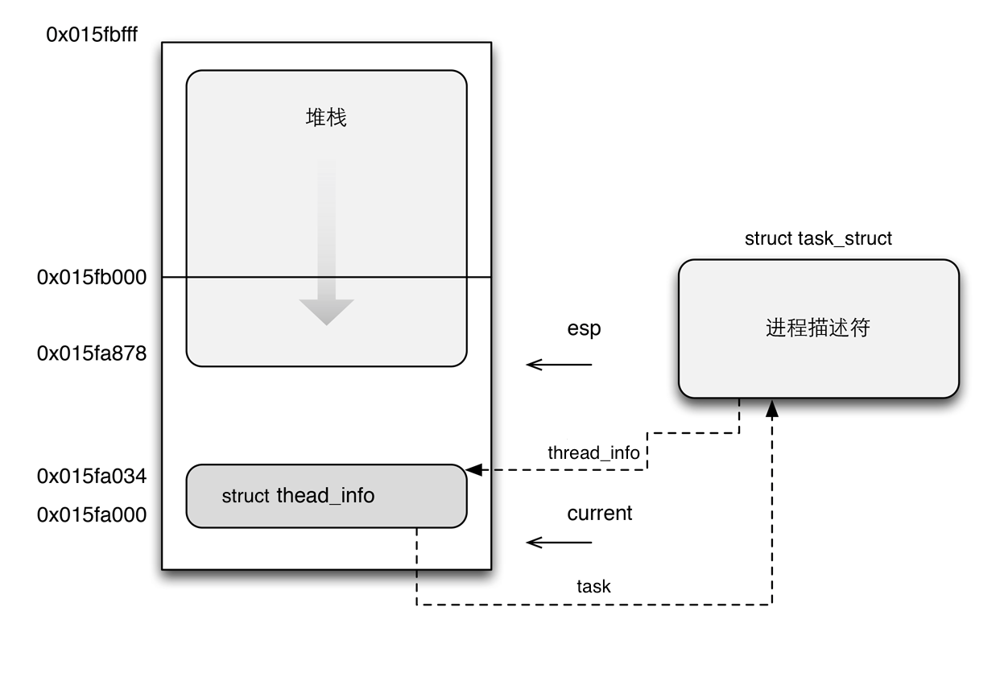
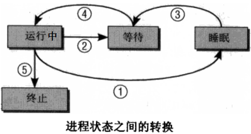

# linux 进程与线程

**对于 Linux 来讲，所有的线程都当作进程来实现**，
因为没有单独为线程定义特定的调度算法，也没有单独为线程定义特定的数据结构
（所有的线程或进程的核心数据结构都是 task_struct）。

> 对于一个进程，相当于是它含有一个线程，就是它自身。对于多线程来说，原本的进程称为主线程，它们在一起组成一个线程组。

**进程拥有自己的地址空间，所以每个进程都有自己的页表。而线程却没有，只能和其它线程共享某一个地址空间和同一份页表**。

这个区别的根本原因是，**在进程/线程创建时，因是否拷贝当前进程的地址空间还是共享当前进程的地址空间，而使得指定的参数不同而导致的**。

具体地说，进程和线程的创建都是执行 clone 系统调用进行的。而 clone 系统调用会执行 do_fork 内核函数，
而它则又会调用 copy_process 内核函数来完成。主要包括如下操作：
- 在调用 copy_process 的过程中，会创建并拷贝当前进程的 task_stuct，
    同时还会创建属于子进程的 thread_info 结构以及内核栈。
- 此后，会为创建好的 task_stuct 指定一个新的 pid（在 task_struct 结构体中）。
- 然后根据传递给 clone 的参数标志，来选择拷贝还是共享打开的文件，文件系统信息，
    信号处理函数，进程地址空间等。这就是进程和线程不一样地方的本质所在。
    
## 数据结构
三个数据结构
每个进程或线程都有三个数据结构，分别是 `struct thread_info`, `struct task_struct` 和 `内核栈`。

注意，**虽然线程与主线程共享地址空间，但是线程也是有自己独立的内核栈的**。

thread_info 对象中存放的进程/线程的基本信息，它和这个进程/线程的内核栈存放在内核空间里的一段 2 倍页长的空间中。
**其中 thread_info 结构存放在低地址段的末尾，其余空间用作内核栈**。内核使用 伙伴系统 为每个进程/线程分配这块空间。

thread_info 结构体中有一个 struct task_struct *task，task 指向的就是这个进程或线程相关的 task_struct 对象
（也在内核空间中），这个对象叫做进程描述符（叫做任务描述符更为贴切，因为每个线程也都有自己的 task_struct）。
内核使用 slab 分配器为每个进程/线程分配这块空间。

如下图所示：


3 task_struct 结构体
每个进程或线程都有只属于自己的 task_struct 对象，是它们各自最为核心的数据结构。

3.1 task_struct 结构体中的主要元素
struct thread_info *thread_info。thread_info 指向该进程/线程的基本信息。
struct mm_struct *mm。mm_struct 对象用来管理该进程/线程的页表以及虚拟内存区。
struct mm_struct *active_mm。主要用于内核线程访问主内核页全局目录。
struct fs_struct *fs。fs_struct 是关于文件系统的对象。
struct files_struct *files。files_struct 是关于打开的文件的对象。
struct signal_struct *signal。signal_struct 是关于信号的对象。
3.2 task_struct 结构体中的三个 ID 与一个指针
pid
每个 task_struct 都会有一个不同的 ID，就是这个 PID。
tid
线程 ID，用来标识每个线程的。
tgid
线程组领头线程的 PID，事实上就是主线程的 PID。
当创建一个子进程时，它的 tgid 与 pid 相等；
当创建一个线程时，它的 tgid 等于主线程的 pid。

getpid() 函数事实上返回的是当前进程或线程的 tgid。

pgid 进程组领头进程的 PID。
sid 会话领头进程的 PID。
group_leader 是一个 task_struct 类型的指针，指向的是进程组的组长对应的 task_struct 对象。  
    
## 内核线程
内核线程是一种只运行在内核地址空间的线程。所有的内核线程共享内核地址空间（对于 32 位系统来说，就是 3-4GB 的虚拟地址空间），
所以也**共享同一份内核页表**。这也是为什么叫内核线程，而不叫内核进程的原因。

# 进程
## 1.进程说明
进程是一个非常复杂的概念，涉及的内容也非常非常多。在这一小节所列出内容，已经是我极度简化后的内容了，
应该尽可能都理解下来，我觉得这些理论比如何使用命令来查看状态更重要，而且不明白这些理论，后面查看状态信息时基本上不知道状态对应的是什么意思。

### 1.1 进程和程序的区别
-  程序是二进制文件，是静态存放在磁盘上的，不会占用系统运行资源(cpu/内存)。
- 进程是用户执行程序或者触发程序的结果，可以认为进程是程序的一个运行实例。

进程是动态的，会申请和使用系统资源，并与操作系统内核进行交互。
在后文中，不少状态统计工具的结果中显示的是system类的状态，其实system状态的同义词就是内核状态


### 1.2 多任务和cpu时间片
现在所有的操作系统都能"同时"运行多个进程，也就是多任务或者说是并行执行。
但实际上这是人类的错觉，**一颗物理cpu在同一时刻只能运行一个进程**，只有多颗物理cpu才能真正意义上实现多任务。

人类会产生错觉，以为操作系统能并行做几件事情，这是通过在极短时间内进行进程间切换实现的，
因为时间极短，前一刻执行的是进程A，下一刻切换到进程B，不断的在多个进程间进行切换，使得人类以为在同时处理多件事情。

不过，cpu如何选择下一个要执行的进程，这是一件非常复杂的事情。在Linux上，决定下一个要运行的进程是通过"调度类"(调度程序)来实现的。
程序何时运行，由进程的优先级决定，但要注意，优先级值越低，优先级就越高，就越快被调度类选中。
除此之外，优先级还影响分配给进程的时间片长短。在Linux中，改变进程的nice值，可以影响某类进程的优先级值。

所有的进程都有机会运行，但重要的进程总是会获得更多的cpu时间，这种方式是"抢占式多任务处理"：
内核可以强制在时间片耗尽的情况下收回cpu使用权，并将cpu交给调度类选中的进程，
此外，在某些情况下也可以直接抢占当前运行的进程。随着时间的流逝，分配给进程的时间也会被逐渐消耗，
当分配时间消耗完毕时，内核收回此进程的控制权，并让下一个进程运行。但因为前面的进程还没有完成，
在未来某个时候调度类还是会选中它，所以内核应该将每个进程临时停止时的运行时环境(寄存器中的内容和页表)
保存下来(保存位置为内核占用的内存)，这称为保护现场，在下次进程恢复运行时，将原来的运行时环境加载到cpu上，
这称为恢复现场，这样cpu可以在当初的运行时环境下继续执行。

看书上说，Linux的调度器不是通过cpu的时间片流逝来选择下一个要运行的进程的，而是考虑进程的等待时间，
即在就绪队列等待了多久，那些对时间需求最严格的进程应该尽早安排其执行。另外，重要的进程分配的cpu运行时间自然会较多。

调度类选中了下一个要执行的进程后，要进行底层的任务切换，也就是上下文切换，这一过程需要和cpu进程紧密的交互。
进程切换不应太频繁，也不应太慢。切换太频繁将导致cpu闲置在保护和恢复现场的时间过长，
保护和恢复现场对人类或者进程来说是没有产生生产力的(因为它没有在执行程序)。
切换太慢将导致进程调度切换慢，很可能下一个进程要等待很久才能轮到它执行，直白的说，如果你发出一个ls命令，你可能要等半天，这显然是不允许的。

至此，也就知道了**cpu的衡量单位是时间**，就像内存的衡量单位是空间大小一样。
进程占用的cpu时间长，说明cpu运行在它身上的时间就长。
注意，cpu的百分比值不是其工作强度或频率高低，而是"**进程占用cpu时间/cpu总时间**"，这个衡量概念一定不要搞错。


### 1.3 父子进程及创建进程的方式
根据执行程序的用户UID以及其他标准，会为每一个进程分配一个唯一的PID。

父子进程的概念，简单来说，在某进程(父进程)的环境下执行或调用程序，这个程序触发的进程就是子进程，
而进程的PPID表示的是该进程的父进程的PID。由此也知道了，子进程总是由父进程创建。

在Linux，父子进程以树型结构的方式存在，父进程创建出来的多个子进程之间称为兄弟进程。
> CentOS 6上，init进程是所有进程的父进程，CentOS 7上则为systemd。

Linux上创建子进程的方式有三种(极其重要的概念)：**fork(),vfork(),clone()**

首先了解下**进程的四要素**：
1. 有一段程序供其执行（不一定是一个进程所专有的），就像一场戏必须有自己的剧本。 
2. 有自己的专用系统堆栈空间（私有财产） 
3. 有进程控制块（task_struct）（“有身份证，PID”），有了这个数据结构，进程才能成为内核调度的一个基本单位，
    从而接受内核的调度。但同时，该数据结构也记录着进程所占用的各项资源
4. 有独立的存储空间(内存)，拥有专有的用户空间。这就是mm_struct结构。该结构登记在进程的财产登记卡task_struct结构中，字段名称为mm。

**缺少第四条的称为线程，如果完全没有用户空间称为内核线程，共享用户空间的称为用户线程**。 

> 关于第4点补充：
从线程和进程的角度来说，进程是资源分配的最小单位，线程是独立调度的最小单位。
同一个进程中的多个线程之间可以并发执行，他们共享进程资源。
线程不拥有资源，线程可以访问隶属进程的资源，进程有自己的独立空间地址，线程没有自己的独立空间地址，但是线程有自己的堆栈和局部变量。

如何理解线程不拥有独立的地址空间但是线程却可以有私有的栈、程序计数器、本地方法区?

**有一种理解是，线程的栈、程序计数器、本地方法区也是存放在进程的地址空间上，
只是这些栈、程序计数器、本地方法区都只能有某个特定的线程去访问、其他的线程访问不到**。

> 每个进程的内存是相互独立的。 否则的话会出现一个问题：我们把指针的值改一改就指向其他进程的内存了，
通过这样我们岂不是就可以看到其他进程中"微信"或者是"网上银行"的信息， 这样的话，
那我们的微信聊天记录或者是银行账户的信息就都被别人找到了，这是一个很危险的信号！显然这样是不可能的。
所有进程要分配一大部分的内存，而线程是共享进程的内存，只需要分配一部分栈就可以了

进程=(线程+内存+文件/网络句柄)

线程=(栈+PC+TLS)
>Program Counter 程序计数器，操作系统真正运行的是一个个的线程， 而我们的进程只是它的一个容器。
PC就是指向当前的指令，而这个指令是放在内存中。 每个线程都有一串自己的指针，去指向自己当前所在内存的指针。 
计算机绝大部分是存储程序性的，说的就是我们的数据和程序是存储在同一片内存里的.
这个内存中既有我们的数据变量又有我们的程序。所以我们的PC指针就是指向我们的内存的。

> thread local storage 之前我们看到每个进程都有自己独立的内存，这时候我们想，
我们的线程有没有一块独立的内存呢?答案是有的，就是TLS。 可以用来存储我们线程所独有的数据。
 可以看到：线程才是我们操作系统所真正去运行的，而进程呢，则是像容器一样他把需要的一些东西放在了一起，
 而把不需要的东西做了一层隔离，进行隔离开来。


#### 1.3.1 fork()

fork()函数调用成功：返回两个值
- 父进程：返回子进程的PID；
- 子进程：返回0；失败：返回-1；

fork 创造的子进程复制了父亲进程的资源（写时复制技术，Copy-On-Write），包括内存的内容task_struct内容（2个进程的pid不同）。
这里是资源的复制不是指针的复制。

fork创建进程的时候，并没有真正的copy内存，因为我们知道，对于fork来讲，有一个很讨厌的东西叫exec系列的系统调用，它会勾引子进程另起炉灶。
如果创建子进程就要内存拷贝的的话，一执行exec，辛辛苦苦拷贝的内存又被完全放弃了。
由于fork()后会产生一个和父进程完全相同的子进程，但子进程在此后多会exec系统调用，处于效率考虑，linux中引入了“写时复制技术-Copy-On-Write”。

换言之，在fork()之后exec之前两个进程用的是相同的物理空间（内存区），先把页表映射关系建立起来，并不真正将内存拷贝。
子进程的代码段、数据段、堆栈都是指向父进程的物理空间，也就是说，两者的虚拟空间不同，但其对应的物理空间是同一个。
当父进程中有更改相应段的行为发生时，如进程写访问，再为子进程相应的段分配物理空间，
如果不是因为exec，内核会给子进程的数据段、堆栈段分配相应的物理空间（至此两者有各自的进程空间，互不影响），
而代码段继续共享父进程的物理空间（两者的代码完全相同）。
而如果是因为exec，由于两者执行的代码不同，子进程的代码段也会分配单独的物理空间。
fork时子进程获得父进程数据空间、堆和栈的复制所以变量的地址（当然是虚拟地址）是一样的。

具体过程是这样的： 
fork子进程完全复制父进程的栈空间，也复制了页表，但没有复制物理页面，所以这时虚拟地址相同，物理地址也相同。
但是会把父子共享的页面标记为“只读”，直到其中任何一个进程要对共享的页面“写操作”，
这时内核会复制一个物理页面给这个进程使用，同时修改页表。
而把原来的只读页面标记为“可写”，留给另外一个进程使用。这就是所谓的“写时复制”。 

- 在理解上：可以认为fork后，这两个相同的虚拟地址指向的是不同的物理地址，这样方便理解父进程之间的独立性。 
- 但实际上，linux为了提高fork的效率，采用了copy-on-write技术，fork后，这两个虚拟地址实际上指向相同的物理地址（内存页）。
只有任何一个进程试图修改这个虚拟地址里的内容前，两个虚拟地址才会指向不同的物理地址。新的物理地址的内容从源物理地址中复制得到。 

问题：fork采用了这种写时复制的机制，那么fork出来子进程后，理论上子进程和父进程那个先调度呢（理论效率分析，个人觉得有一定的道理）？

fork之后内核一般会通过将子进程放在队列的前面，以让子进程先执行，因为很多情况下子进程要马上执行exec，
会清空栈、堆，这些和父进程共享的空间，加载新的代码段。。这就避免了父进程“写时复制”拷贝共享页面的机会。
如果父进程先调度很可能写共享页面，而子进程什么也没做，会产生“写时复制”的无用功。所以，一般子进程先调度。避免因无意义的复制而造成效率的下降。 

#### 1.3.2  vfork()
vfork是一个过时的应用，vfork也是创建一个子进程，但是子进程共享父进程的空间。
在vfork创建子进程之后，父进程阻塞，直到子进程执行了exec()或者exit()。
vfork最初出现是因为fork没有实现COW机制，而很多情况下fork之后会紧接着exec，
而exec的执行相当于之前fork复制的空间全部变成了无用功，所以设计了vfork。
而现在fork使用了COW机制，唯一的代价仅仅是复制父进程页表的代价，所以vfork不应该出现在新的代码之中。      
           
> vfork创建出来的不是真正意义上的进程，而是一个线程，因为它经常缺少要素4，独立的内存资源

 子进程共享了父进程虚存空间，没有自己独立的虚存空间不能称其为进程

#### 1.3.3 clone()
**clone的工作原理和fork相同，但clone出来的新进程不独立于父进程，它只会和父进程共享某些资源，在clone进程的时候，可以指定要共享的是哪些资源。**

 clone是Linux为创建线程设计的（虽然也可以用clone创建进程）。
 所以可以说clone是fork的升级版本，不仅可以创建进程或者线程，
 还可以指定创建新的命名空间（namespace）、有选择的继承父进程的内存、甚至可以将创建出来的进程变成父进程的兄弟进程等等。

 clone函数功能强大，带了众多参数，它提供了一个非常灵活自由的常见进程的方法
 。因此由他创建的进程要比前面2种方法要复杂。clone可以让你有选择性的继承父进程的资源，
 你可以选择想vfork一样和父进程共享一个虚存空间，从而使创造的是线程，
 你也可以不和父进程共享，你甚至可以选择创造出来的进程和父进程不再是父子关系，而是兄弟关系。

clone和fork的区别：
- clone和fork的调用方式很不相同，clone调用需要传入一个函数，该函数在子进程中执行。
- clone和fork最大不同在于clone不再复制父进程的栈空间，而是自己创建一个新的。 
    （void *child_stack,）也就是第二个参数，需要分配栈指针的空间大小，所以它不再是继承或者复制，而是全新的创造。
    
#### 1.3.4 exec
**exec是加载另一个应用程序，替代当前运行的进程**，也就是说在不创建新进程的情况下加载一个新程序。
exec还有一个动作，在进程执行完毕后，退出exec所在环境(实际上是进程直接跳转到exec上，执行完exec就直接退出。
而非exec加载程序的方式是：父进程睡眠，然后执行子进程，执行完后回到父进程，所以不会立即退出当前环境)。
所以为了保证进程安全，若要形成新的且独立的子进程，都会先fork一份当前进程，然后在fork出来的子进程上调用exec来加载新程序替代该子进程。
例如在bash下执行cp命令，会先fork出一个bash，然后再exec加载cp程序覆盖子bash进程变成cp进程。

但要注意，fork进程时会复制所有内存页，但使用exec加载新程序时会初始化地址空间，意味着复制动作完全是多余的操作，
当然，有了写时复制技术不用过多考虑这个问题。


### 1.4 进程状态




注意上面的图2中，没有"就绪-->睡眠"和"睡眠-->运行"的状态切换。这很容易理解。
对于"就绪-->睡眠",等待中的进程本就已经进入了等待队列，表示可运行，而进入睡眠态表示暂时不可运行，这本身就是冲突的；
对于"睡眠-->运行"这也是行不通的，因为调度类只会从等待队列中挑出下一次要运行的进程。

再说说运行态-->睡眠态。从运行态到睡眠态一般是等待某事件的出现，例如等待信号通知，等待IO完成。
信号通知很容易理解，而对于IO等待，程序要运行起来，cpu就要执行该程序的指令，同时还需要输入数据，
可能是变量数据、键盘输入数据或磁盘文件中的数据，后两种数据相对cpu来说，都是极慢极慢的。
但不管怎样，如果cpu在需要数据的那一刻却得不到数据，cpu就只能闲置下来，这肯定是不应该的，
因为cpu是极其珍贵的资源，所以内核应该让正在运行且需要数据的进程暂时进入睡眠，
等它的数据都准备好了再回到等待队列等待被调度类选中。这就是IO等待。

其实上面的图中少了一种进程的特殊状态——僵尸态。
僵尸态进程表示的是进程已经转为终止态，它已经完成了它的使命并消逝了，但是内核还没有来得及将它在进程列表中的项删除，
也就是说内核没给它料理后事，这就造成了一个进程是死的也是活着的假象，
说它死了是因为它不再消耗额外资源(但可能会占用未释放的资源)，
调度类也不可能选中它并让它运行，说它活着是因为在进程列表中还存在对应的表项，可以被捕捉到。
僵尸态进程并不一定会占用多少资源(除非fork出来的大量进程都占用了未释放的资源且成了僵尸进程)，
正常情况下的大多数僵尸进程仅在进程列表中占用一点点的内存，大多数僵尸进程的出现都是因为进程正常终止(包括kill -9)，
但父进程没有确认该进程已经终止，内核也不知道该进程已经终止了。僵尸进程更具体说明见后文。

另外，睡眠态是一个非常宽泛的概念，分为可中断睡眠和不可中断睡眠。可中断睡眠是允许接收外界信号和内核信号而被唤醒的睡眠，
绝大多数睡眠都是可中断睡眠，能ps或top捕捉到的睡眠也几乎总是可中断睡眠；
不可中断睡眠只能由内核发起信号来唤醒，外界无法通过信号来唤醒，主要表现在和硬件交互的时候。
例如cat一个文件时，从硬盘上加载数据到内存中，在和硬件交互的那一小段时间一定是不可中断的，
否则在加载数据的时候突然被人为发送的信号手动唤醒，而被唤醒时和硬件交互的过程又还没完成，
所以即使唤醒了也没法将cpu交给它运行，所以cat一个文件的时候不可能只显示一部分内容。
而且，不可中断睡眠若能被人为唤醒，更严重的后果是硬件崩溃。
由此可知，不可中断睡眠是为了保护某些重要进程，也是为了让cpu不被浪费。

其实只要发现进程存在，且非僵尸态进程，还不占用cpu资源，那么它就是睡眠的。包括后文中出现的暂停态、追踪态，它们也都是睡眠态。


例子：
进程间状态的转换情况可能很复杂，这里举一个例子，尽可能详细地描述它们。

以在bash下执行cp命令为例。在当前bash环境下，处于可运行状态(即就绪态)时，当执行cp命令时，
首先fork出一个bash子进程，然后在子bash上exec加载cp程序，cp子进程进入等待队列，
由于在命令行下敲的命令，所以优先级较高，调度类很快选中它。在cp这个子进程执行过程中，
父进程bash会进入睡眠状态(不仅是因为cpu只有一颗的情况下一次只能执行一个进程，还因为进程等待)，
并等待被唤醒，此刻bash无法和人类交互。当cp命令执行完毕，它将自己的退出状态码告知父进程，此次复制是成功还是失败，
然后cp进程自己消逝掉，父进程bash被唤醒再次进入等待队列，并且此时bash已经获得了cp退出状态码。
根据状态码这个"信号"，父进程bash知道了子进程已经终止，所以通告给内核，内核收到通知后将进程列表中的cp进程项删除。至此，整个cp进程正常完成。

假如cp这个子进程复制的是一个大文件，一个cpu时间片无法完成复制，那么在一个cpu时间片消耗尽的时候它将进入等待队列。

假如cp这个子进程复制文件时，目标位置已经有了同名文件，那么默认会询问是否覆盖，发出询问时它等待yes或no的信号，
所以它进入了睡眠状态(可中断睡眠)，当在键盘上敲入yes或no信号给cp的时候，cp收到信号，从睡眠态转入就绪态，等待调度类选中它完成cp进程。

在cp复制时，它需要和磁盘交互，在和硬件交互的短暂过程中，cp将处于不可中断睡眠。

假如cp进程结束了，但是结束的过程出现了某种意外，使得bash这个父进程不知道它已经结束了(此例中是不可能出现这种情况的)，
那么bash就不会通知内核回收进程列表中的cp表项，cp此时就成了僵尸进程。

### 1.5 信号
信号在操作系统中控制着进程的绝大多数动作，信号可以让进程知道某个事件发生了，也指示着进程下一步要做出什么动作。
信号的来源可以是硬件信号(如按下键盘或其他硬件故障)，也可以是软件信号(如kill信号，还有内核发送的信号)。
不过，很多可以感受到的信号都是从进程所在的控制终端发送出去的。

Signal     Value     Comment
─────────────────────────────
SIGHUP        1      终端退出时，此终端内的进程都将被终止
SIGINT        2      中断进程，可被捕捉和忽略，几乎等同于sigterm，所以也会尽可能的释放执行clean-up，释放资源，保存状态等(CTRL+C)
SIGQUIT       3      从键盘发出杀死(终止)进程的信号

SIGKILL       9      强制杀死进程，该信号不可被捕捉和忽略，进程收到该信号后不会执行任何clean-up行为，所以资源不会释放，状态不会保存
SIGTERM      15      杀死(终止)进程，可被捕捉和忽略，几乎等同于sigint信号，会尽可能的释放执行clean-up，释放资源，保存状态等
SIGCHLD      17      当子进程中断或退出时，发送该信号告知父进程自己已完成，父进程收到信号将告知内核清理进程列表。所以该信号可以解除僵尸进
                     程，也可以让非正常退出的进程工作得以正常的clean-up，释放资源，保存状态等。
 
SIGSTOP      19      该信号是不可被捕捉和忽略的进程停止信息，收到信号后会进入stopped状态
SIGTSTP      20      该信号是可被忽略的进程停止信号(CTRL+Z)
SIGCONT      18      发送此信号使得stopped进程进入running，该信号主要用于jobs，例如bg & fg 都会发送该信号。
                     可以直接发送此信号给stopped进程使其运行起来  
  
SIGUSR1      10      用户自定义信号1
SIGUSR2      12      用户自定义信号2 


除了这些信号外，还需要知道一个特殊信号：代码为0的信号。此信号为EXIT信号，表示直接退出。
如果kill发送的信号是0(即kill -0)则表示不做任何处理直接退出，但执行错误检查：
当检查发现给定的pid进程存在，则返回0，否则返回1。
也就是说，0信号可以用来检测进程是否存在，可以代替 ps aux | grep proc_name 。
(man kill中的原文为：If sig is 0, then no signal is sent, but error checking is still performed。
而man bash的trap小节中有如下描述：If a sigspec is EXIT (0)，这说明0信号就是EXIT信号)

以上所列的信号中，**只有SIGKILL和SIGSTOP这两个信号是不可被捕捉且不可被忽略的信号**，
其他所有信号都可以通过trap或其他编程手段捕捉到或忽略掉。

### 1.6 僵尸进程
一个编程完善的程序，在子进程终止、退出的时候，内核会发送SIGCHLD信号给其父进程，父进程收到信号就会对该子进程进行善后
(接收子进程的退出状态、释放未关闭的资源)，同时内核也会进行一些善后操作(比如清理进程表项、关闭打开的文件等)。

在子进程死亡的那一刹那，子进程的状态就是僵尸进程，但因为发出了SIGCHLD信号给父进程，父进程只要收到该信号，
子进程就会被清理也就不再是僵尸进程。
所以正常情况下，所有终止的进程都会有一小段时间处于僵尸态(发送SIGCHLD信号到父进程收到该信号之间)，
只不过这种僵尸进程存在时间极短(倒霉的僵尸)，几乎是不可被ps或top这类的程序捕捉到的。

如果在特殊情况下，子进程终止了，但父进程没收到SIGCHLD信号，没收到这信号的原因可能是多种的，
不管如何，此时子进程已经成了永存的僵尸，能轻易的被ps或top捕捉到。僵尸不倒霉，人类就要倒霉，
但是僵尸爸爸并不知道它儿子已经变成了僵尸，因为有僵尸爸爸的掩护，僵尸道长即内核见不到小僵尸，
所以也没法收尸。悲催的是，人类能力不足，直接发送信号(如kill)给僵尸进程是无效的，因为僵尸进程本就是终结了的进程，
它收不到信号，只有内核从进程列表中将僵尸进程表项移除才算完成收尸。

要解决掉永存的僵尸有几种方法：

1. 杀死僵尸进程的父进程。没有了僵尸爸爸的掩护，小僵尸就暴露给了僵尸道长的直系弟子init/systemd，
    init/systemd会定期清理它下面的各种僵尸进程。所以这种方法有点不讲道理，僵尸爸爸是正常的啊，
    不过如果僵尸爸爸下面有很多僵尸儿子，这僵尸爸爸肯定是有问题的，比如编程不完善，杀掉是应该的。

2. 手动发送SIGCHLD信号给僵尸进程的父进程。僵尸道长找不到僵尸，但被僵尸祸害的人类能发现僵尸，
    所以人类主动通知僵尸爸爸，让僵尸爸爸知道自己的儿子死而不僵，然后通知内核来收尸。

当然，第二种手动发送SIGCHLD信号的方法要求父进程能收到信号，而SIGCHLD信号默认是被忽略的，
所以应该显式地在程序中加上获取信号的代码。也就是人类主动通知僵尸爸爸的时候，默认僵尸爸爸是不搭理人类的，
所以要强制让僵尸爸爸收到通知。不过一般daemon类的程序在编程上都是很完善的，发送SIGCHLD总是会收到，不用担心。


**SIGHUP**

1. 当控制终端退出时，会向该终端中的进程发送sighup信号，因此该终端上运行的shell进程、其他普通进程以及任务都会收到sighup而导致进程终止。

    多种方式可以改变因终端中断发送sighup而导致子进程也被结束的行为，这里仅介绍比较常见的三种：
    - 一是使用nohup命令启动进程，它会忽略所有的sighup信号，使得该进程不会随着终端退出而结束；
    - 二是将待执行命令放入子shell中并放入后台运行，例如"(sleep 10 &)"；
    - 三是使用disown，将任务列表中的任务移除出job table或者直接使用disown -h的功能设置其不接收终端发送的sighup信号。
        
   但不管是何种实现方式，终端退出后未被终止的进程将只能挂靠在init/systemd下。

2. 对于daemon类的程序(即服务性进程)，这类程序不依赖于终端(它们的父进程都是init或systemd)，
    它们收到sighup信号时会重读配置文件并重新打开日志文件，使得服务程序可以不用重启就可以加载配置文件。
    
[其他参考1](https://www.cnblogs.com/f-ck-need-u/p/7058920.html)
[其他参考2](https://www.cnblogs.com/alantu2018/p/8526916.html)

# 线程
内核线程
### 为什么需要内核线程
Linux内核可以看作一个服务进程(管理软硬件资源，响应用户进程的种种合理以及不合理的请求)。

内核需要多个执行流并行，为了防止可能的阻塞，支持多线程是必要的。

内核线程就是内核的分身，一个分身可以处理一件特定事情。内核线程的调度由内核负责，
一个内核线程处于阻塞状态时不影响其他的内核线程，因为其是调度的基本单位。

这与用户线程是不一样的。因为内核线程只运行在内核态

因此，它只能使用大于PAGE_OFFSET（传统的x86_32上是3G）的地址空间。

### 内核线程概述
内核线程是直接由内核本身启动的进程。内核线程实际上是将内核函数委托给独立的进程，
它与内核中的其他进程”并行”执行。内核线程经常被称之为内核守护进程。

他们执行下列任务

- 周期性地将修改的内存页与页来源块设备同步
- 如果内存页很少使用，则写入交换区
- 管理延时动作,　如２号进程接手内核进程的创建
- 实现文件系统的事务日志

内核线程主要有两种类型
- 线程启动后一直等待，直至内核请求线程执行某一特定操作。
- 线程启动后按周期性间隔运行，检测特定资源的使用，在用量超出或低于预置的限制时采取行动。

内核线程由内核自身生成，其特点在于
- 它们在CPU的管态执行，而不是用户态。
- 它们只可以访问虚拟地址空间的内核部分（高于TASK_SIZE的所有地址），但不能访问用户空间

### 内核线程的进程描述符task_struct
task_struct进程描述符中包含两个跟进程地址空间相关的字段mm, active_mm，

```c
struct task_struct
{
    // ...
    struct mm_struct *mm;
    struct mm_struct *avtive_mm;
    //...
};
```
大多数计算机上系统的全部虚拟地址空间分为两个部分: 供用户态程序访问的虚拟地址空间和供内核访问的内核空间。
每当内核执行上下文切换时, 虚拟地址空间的用户层部分都会切换, 以便当前运行的进程匹配, 而内核空间不会放生切换。

**对于普通用户进程来说，mm指向虚拟地址空间的用户空间部分，而对于内核线程，mm为NULL**。

这位优化提供了一些余地, 可遵循所谓的惰性TLB处理(lazy TLB handing)。active_mm主要用于优化，
由于内核线程不与任何特定的用户层进程相关，内核并不需要倒换虚拟地址空间的用户层部分，保留旧设置即可。
\由于内核线程之前可能是任何用户层进程在执行，故用户空间部分的内容本质上是随机的，内核线程决不能修改其内容，
故将mm设置为NULL，同时如果切换出去的是用户进程，内核将原来进程的mm存放在新内核线程的active_mm中，
因为某些时候内核必须知道用户空间当前包含了什么。


### 进程vs线程
最后再总结一下  进程VS 线程

1. 进程采用fork创建，线程采用clone创建
2. 进程fork创建的子进程的逻辑流位置在fork返回的位置，线程clone创建的KSE的逻辑流位置在clone调用传入的方法位置，比如Java的Thread的run方法位置
3. 进程拥有独立的虚拟内存地址空间和内核数据结构(页表，打开文件表等)，当子进程修改了虚拟页之后，会通过写时拷贝创建真正的物理页。线程共享进程的虚拟地址空间和内核数据结构，共享同样的物理页
4. 多个进程通信只能采用进程间通信的方式，比如信号，管道，而不能直接采用简单的共享内存方式，原因是每个进程维护独立的虚拟内存空间，所以每个进程的变量采用的虚拟地址是不同的。多个线程通信就很简单，直接采用共享内存的方式，因为不同线程共享一个虚拟内存地址空间，变量寻址采用同一个虚拟内存
5. 进程上下文切换需要切换页表等重量级资源，线程上下文切换只需要切换寄存器等轻量级数据
6. 进程的用户栈独享栈空间，线程的用户栈共享虚拟内存中的栈空间，没有进程高效
7. 一个应用程序可以有多个进程，执行多个程序代码，多个线程只能执行一个程序代码，共享进程的代码段
8. 进程采用父子结构，线程采用对等结构
9. 线程必定也只能属于一个进程，而进程可以拥有多个线程而且至少拥有一个线程；


一开始是进程模型处理程序，后面引入了线程模型。

如果cpu只支持进程模型，cpu利用率很低。当cpu运行一个进程时，其他进程挂起。

假设一个进程，20%需要做cpu运算，80%在做IO（发送IO事件时，cpu时闲置的）=>cpu利用率是20%

单道编程模型：cup利用率=1-0.8=20%

多道编程模型下：          
- 同时执行两个进程的话：1-0.8*0.8=36%
- 同时执行三个进程的话：1-0.8*0.8*0.8=48.8%

进程模型，目的就是为了满足多道编程，而多道编程的目的就是为了提高cpu的利用率。随着进程数量的增加，cpu的利用率逐步提高。

而引入线程模型，目的就是为了让进程可以同时做多件事（线程是进程的分身）。
此外，引入线程模型后，cpu的最小执行单位就变成了线程，而进程变成了资源组织者。