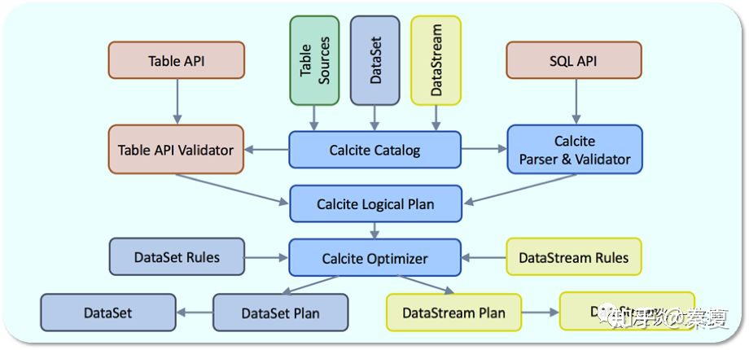

## calcite 设计思路

那 Apache Calcite 究竟是干嘛的，又为什么能这么流行呢？

首先，摆一个应该没多少人会反对的共识：SQL 是编程领域最流行的语言。
有 MySQL、Oracle 之类使用 SQL 作为交互语言的数据库然后有 JDBC、ODBC 之类和各种数据库交互的标准接口
有大量数据科学家和数据分析师等不太会编程语言但又要使用数据的人
第一代大数据计算引擎 MapReduce 被 Hive SQL 很大程度上替代
新一代大数据计算引擎 Spark 很快就推出了 Spark SQL最近几年大热的流处理引擎 Flink 很快也推出了 Flink SQL......

这样的例子还可以举出很多。

SQL 我们用起来很顺手，但实现起来呢，却并不容易。
比如要给 MongoDB 套上一个 SQL 的壳子，或者要想直接用 SQL 查一堆 CSV 文件，恐怕没多少人能顺利的自己实现。

Apache Calcite 的出现，让你能够很容易的给你的系统套上一个 SQL 的壳子，并且能提供足够高效的查询性能优化。
下面不会想很多帖子一样，去解释 Calcite 是怎么做到这一点的，这样的东西太多了，没有必要重复。

今天，我想从设计的角度聊下为什么 Calcite 能这么流行。足够简单和 focus 的定位通常我们可以把一个数据库管理系统分为五个组件。
- **query language**
- **query optimization**
- **query execution**
- data management
-  data storage

Calcite 在设计之初就确定了自己只关注和实现上面前三个粗体部分，而把后面部分的数据管理和数据存储留给了各个外部存储/计算引擎。

通常数据管理和数据存储，尤其是后者是很复杂的，也会由于数据本身的特性导致实现上的多样性。
Calcite 抛弃了这两部分，而是专注于上层更加通用的模块，使得自己能够轻装上阵，系统的复杂性得到控制，开发人员的精力也不至于铺的太开。

另一方面，Calcite 没有去重复造各种轮子，在该用现成的东西的时候，就直接用能找到的最合适的。
这是个非常好的习惯，但也是非常容易被程序员抵触的方法。

比如，作为一个 SQL 解决方案，关键的 SQL 解析这一步，Calcite 没有选择造轮子，而是直接使用了开源的 JavaCC，
来将 **SQL 语句转化为 Java 代码，然后转化成一颗 AST** 供下一阶段使用。

另一个例子，为了支持后面会提到的灵活的元数据功能，Calcite 需要支持运行时编译 Java 代码。
默认的JavaC 太重，需要一个更轻量级的编译器，Calcite 同样没有选择造轮子，而是使用了开源的 Janino 方案。

**足够简单和 focus 的定位，不重复造轮子**，使得 Calcite 的实现足够简单和稳定。


灵活可插拔的架构上面的图是 Calcite 官方给出的架构图。

一方面印证了我们上面提到的，Calcite 足够简单，没有做自己不该做的事；

另一方面，也是更重要的，Calcite 被设计的足够模块化和可插拔。

- JDBC Driver 这个模块用来支持使用 JDBC client 的应用；
- SQL Parser and Validator 模块用来做 SQL 解析和校验；
- Expressions Builder 用来支持自己做 SQL 解析和校验的框架对接；
- Operator Expressions 这个模块用来处理关系表达式；
- Metadata Providers 用来支持外部自定义元数据；
- Pluggable Rules 用来定义优化规则；
- 最核心的 Query Optimizer 则专注查询优化。

功能模块的划分足够合理，足够独立，使得不用完整集成，而是可以只选择其中的一部分使用；
而基本上每个模块都支持自定义，也使得用户能更多地定制系统。

很多框架对 Calcite 有集成。
 Hive 就自己做了 SQL 解析，只使用了Calcite 的查询优化功能；
 而 Flink 则从解析到优化都直接使用了 Calcite。


 Flink 对 Calcite 的使用，从这个 Flink 的架构图看的会更清楚。
Flink 提供了 Table API 和 SQL API 两种形式来支持对格式化数据的处理。 

SQL API 通过 Calite 的 SQL Parser 和 Validator 转成逻辑执行计划，而Table API 直接转换成 Calcite 的逻辑执行计划。
二者在这里达到统一，再通过 Calcite 做优化，完了之后再转成对应的物理执行计划，Table API 对应对 DataSet 的操作，SQL API 对应对 DataStream 的操作。

以上说的集成方法，都是把 Calcite 的模块当做库使用。

如果觉得太重量级，可以选择更简单的 Adapter的方式。
通过类似 Spark/Flume 这些框架里自定义 Source/Sink 的方式，来实现和外部系统的数据交互操作。

上图列的就是集中典型的 Adapter，比如通过 MongoDB 的 Adapter 就能直接在应用层通过 SQL，而底层自动转换成 Java 和 MongoDB 完成交互。

当然如果社区没有现成的实现，也很容易自己按照 API 规范去实现一个。
对多种异构数据源的支持除了对标准 SQL 的支持，Calcite 还支持各种丰富的数据源。

上图所示，就是对 MongoDB 的支持，通过 _MAP[key] 的方式就能很方便的访问到 mongo 里面的半结构化数据。

上图就是对流数据的支持，通过 STREAM 关键字，扩展了 Calcite 的能力，当然还支持窗口函数等比较高级的流功能。
另外，Calcite 还支持对空间地理数据的处理，也是通过一组内置的函数提供了原生支持，而不用自己再去打 UDF。

动态和灵活的查询优化提到查询优化，不得不提**关系代数（Relational Algebra**和**关系表达式（Relational Expression）**，
这也是 Calcite 的核心概念之一。
这里不展开介绍，大家可以单独再去了解。我们看一个例子，

```sql
INSERT INTO tmp_node
SELECT s1.id1, s1.id2, s2.val1
FROM source1 as s1 INNER JOIN source2 AS s2
ON s1.id1 = s2.id1 and s1.id2 = s2.id2 where s1.val1 > 5 and s2.val2 = 3;
```
上图的 SQL 语句通过 SQL 解析和验证后，会先被转换成下面这样的关系表达式：

```sql
LogicalTableModify(table=[[TMP_NODE]], operation=[INSERT], flattened=[false])
  LogicalProject(ID1=[$0], ID2=[$1], VAL1=[$7])
    LogicalFilter(condition=[AND(>($2, 5), =($8, 3))])
      LogicalJoin(condition=[AND(=($0, $5), =($1, $6))], joinType=[INNER])
        LogicalTableScan(table=[[SOURCE1]])
        LogicalTableScan(table=[[SOURCE2]])
```
很简单，就是先对两个表做 scan，完了再用 id 字段做 join，再做一个 filter，最后 project 挑出想要的字段。

如果要用**一句话解释关系代数，就是定义了什么样的关系表达式是等价的**。上面的关系表达式会被 Calcite 通过关系代数转换成下面这样：

```sql
//谓词下推，投影下推，关系代数定律优化
LogicalTableModify(table=[[TMP_NODE]], operation=[INSERT], flattened=[false])
  LogicalProject(ID1=[$0], ID2=[$1], VAL1=[$7])
      LogicalJoin(condition=[AND(=($0, $5), =($1, $6))], joinType=[inner])
        LogicalFilter(condition=[=($4, 3)])  
          LogicalProject(ID1=[$0], ID2=[$1],      ID3=[$2], VAL1=[$3], VAL2=[$4],VAL3=[$5])
            LogicalTableScan(table=[[SOURCE1]])
        LogicalFilter(condition=[>($3,5)])    
          LogicalProject(ID1=[$0], ID2=[$1], ID3=[$2], VAL1=[$3], VAL2=[$4],VAL3=[$5])
            LogicalTableScan(table=[[SOURCE2]])
```
相信大家都看的懂，通过 push down filter 和 push down project，大大减少了数据量，也就是减少了IO.
而 IO 通常都是性能瓶颈，自然就大大提升了性能。**这样提升性能的等价关系表达式转换，就是查询优化**。

显然，关系代数本身就一定程度上体现了 SQL 查询的计算方案。
 一般来说，实际的数据库实现还存在逻辑代数处理阶段和物理实现处理阶段， 这两个阶段使用的算子不同。
 
数据流动也存在 Pull 模式和 Push 模式两种。 在这里我们先略去对这些信息的讨论，单纯研究如何通过关系代数优化执行方案。


而类似 push down filter 这样的转换就叫做 planner rule。类似这样的 rule 还有很多，不一一罗列了。
知道了怎么优化，怎么样算优化完了呢，不可能一直这么转换下去吧？

当然不会，决定什么时候停止优化的是 Planner Engine。
目前 Calcite 支持两种 Planner Engine：
- HepPlanner，优化到关系表达式不再变化为止。
- VolcanoPlanner，优化到查询成本不再明显变化为止。

很显然，HepPlanner 更表象点，不一定就能得到最优解，但优点是速度快；

而 VolcanoPlanner 则更准确些，有 cost 来量化做比较，缺点自然是稍慢。

用户可以自由选择用哪一种，比如 Hive 就用的 VolcanoPlanner 来做 CBO。

接着很自然能想到的问题，就是怎么计算 cost 了。

而这里又体现 Calcite 的灵活性了，除了提供默认的 cost function，还允许前面提到的 metadata provider提供自定义的 cost function。
通常会被用来计算 cost 的有行数、空间大小、笛卡尔积大小等等，这里不过多展开。

最后，总结下。通过足够简单和 focus 的定位可插拔的架构Calcite 做到了让集成足够简单。
通过对多种异构数据源的支持动态和灵活的查询优化Calcite 让自己能在更广阔的领域被使用。

这就是我今天想跟大家分享的几个要点，也是我们在系统设计过程中值得参考和借鉴的思路。

查询优化可能是 Calcite 被使用最多的功能，也是很有技术含量的一个话题。
后面会单独开一篇文章，我们一起看看 Hive 是怎么利用 Calcite 做查询优化的。

感兴趣的朋友请扫二维码关注我的公众号，也可以搜索「漫谈大数据」或者「sobigdata」。