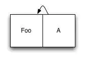
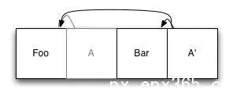
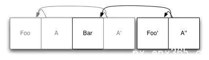
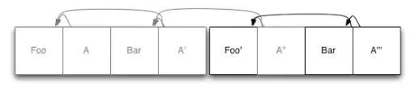

日志结构化储存

如果你正在设计一个存储系统，例如一个文件系统或者数据库，你主要问题之一是如何把数据储存到磁盘上。你不仅要注意存储索引数据，也要注意为存储对象分配空间；你不仅要担忧当你想扩大一个现有的模块(例如，附加到文件)会发生什么，注意新旧对象交替时候产生的存储碎片。所有的这些增加了很多复杂度，解决方案往往或者有缺陷或者效率低。这时候[日志](https://link.jianshu.com?t=http%3A%2F%2Fwww.yidianzixun.com%2Fchannel%2Fw%2F%E6%97%A5%E5%BF%97)结构化存储就显得很重要，本文就为大家详细介绍日志结构化存储：

顾名思义，日志结构化存储系统的基础组织是一个日志，即一个只可添加数据输入的序列。每当你有新的数据要写入的时候，你只需要简单的添加它到日志的末尾，而不需要在磁盘中为它寻找一个位置。索引数据可以通过对元数据进行同样处理得到：元数据的更新同样添加到日志中。这看起来似乎效率不高，但是基于磁盘的索引结构(比如B-树)通常非常广泛，所以我们每次写入是需要更新的索引节点数目通常非常小。让我们看看一个简单的例子。我们将从仅包含一个单项数据的日志开始，并且有一个索引节点引用它：

到目前为止一切顺利。现在，假设我们想增加第二个元素。我们把新的元素添加到日志的末尾，然后我们更新索引项，并且也把更新后的版本添加到日志：

最初的索引项(A)仍然在[日志文件](https://link.jianshu.com?t=http%3A%2F%2Fwww.yidianzixun.com%2Fchannel%2Fw%2F%E6%97%A5%E5%BF%97%E6%96%87%E4%BB%B6)中，但不再使用了：它被新的项A’替换了，A’不仅引用新项Bar，还引用原始的未更改的[Foo](https://link.jianshu.com?t=http%3A%2F%2Fwww.yidianzixun.com%2Fchannel%2Fw%2Ffoo)的副本。当某物想要读取我们的文件系统的时候，它需寻找索引节点的根节点，然后可以像其他任何使用基于磁盘的索引的系统中一样使用它。

快速的寻找索引的根节点看来很必要。最简单的方法是只看日志的最后一块，因为我们最后写的东西常常是索引的根节点。然而，这是不理想的，因为有可能当你试图读取索引的时候，另外一个进程中途添加到日志中。我们可以通过一个单程序段(例如在[日志文件](https://link.jianshu.com?t=http%3A%2F%2Fwww.yidianzixun.com%2Fchannel%2Fw%2F%E6%97%A5%E5%BF%97%E6%96%87%E4%BB%B6)的开头)来避免这种情况的发生，这样的单程序段包含一个当前根节点的指针。当我们更新日志的时候，我们重写第一项来保证它指向新的根节点。为了简便起见，我们没有在图表中展示出来。

下面，让我们看看更新元素时会发生什么。例如我们修改Foo：

我们首先在日志的尾部写入一个Foo的全新副本。然后，我们再次更新索引节点(这里只有A’)，并且也把它们写到日志的末尾。再次，[Foo](https://link.jianshu.com?t=http%3A%2F%2Fwww.yidianzixun.com%2Fchannel%2Fw%2Ffoo)的旧副本仍在日志中，只是它不再被更新的索引引用了。

你可能已经意识到这个系统不会无限期地持续下去。在所有的旧数据占据空间的情况下，我们将在某一时刻用完所有的存储空间。在一个文件系统中，是通过将磁盘看成一个环形缓冲器，覆盖老的日志数据，来解决这个问题的。当遇到这种情况，仍然有效的数据只是被重新添加到日志中，就像是新写入的一样，这释放了被覆盖的老的副本。

在普通的文件系统中，会有一个我在前面提到的缺点出现。随着磁盘被占满，文件系统需要花费越来越多的时间来做垃圾回收和将数据写回日志的开头。当你达到80%的时候，你的文件系统几乎慢慢停下来。

然而，如果你使用的是日志结构化存储作为数据库引擎，这不是一个问题！我们将会在一个普通的文件系统上执行这个，所以我们可以用它来使得我们的生活更简单。如果我们将数据库分成一些定长块，那么当我们需要回收一些空间的时候，我们可以挑选一个块，重写任意仍然活跃的数据，并且删除这个块。上面例子的第一部分是开始看起来有一点稀疏，所以让我们那样做吧：

我们在这里做的是取Bar的现存副本并且把它写到日志的末尾，然后像上面所说的那样更新索引节点。既然我们已经做好了，第一个日志段已经完全空了，可以删除了。

这种方法和文件系统的方法相比有几个优点。一开始，我们并没有局限于最先删除最老的部分：如果有一个中间部分几乎是空的，我们可以选择垃圾回收这个，而不是最老的那个。这个对于那些有需要停留很长时间或者需要反复重写的数据的数据库尤其有用：我们不想浪费太多时间在重写相同的没有被修改的数据上。我们在什么时候垃圾回收上也有了更多的灵活性：我们通常可以等到一个部分几乎没用的时候再回收它，进一步缩小了额外的工作量。

不过，这种方法应用在数据库上还有优点。为了保持事务一致性，数据库通常使用一个“预写日志”(

 Write Ahead

Log，WAL)。当一个数据库想把一个事务更改持久化到磁盘上时，它首先将所有的改变写到WAL上，刷新这些到磁盘上，然后更新实际的数据库文件。这使得它可以通过重新同步记录在WAL上的事务来从崩溃中恢复。不过，如果我们使用日志结构化存储，预写日志是数据库文件，所以我们只需要重写一次数据。在恢复状态，我们只要打开数据库，从最后记录的索引标题开始，并且线性地向前搜索，从数据中重建任意缺失的索引更新。

利用上面的恢复计划，我们也可以进一步优化写入。我们可以把它们缓存到[内存](https://link.jianshu.com?t=http%3A%2F%2Fwww.yidianzixun.com%2Fchannel%2Fw%2F%E5%86%85%E5%AD%98)中，仅仅定期把它们写到磁盘中，而不是在每次写入的时候都写入更新索引节点。只要我们提供一些方法从不完整的事务中辨别出完整事务，我们的恢复机制会注意重建崩溃后的东西。

利用这种方法，备份也会更简单：我们可以不断地逐步地副本每个新的日志部分到备份媒介，因为它已经完成了，备份数据库。为了恢复，我们仅需再次运行恢复过程。

这个系统最后一个重要的优势涉及到数据库中的并发性和事务语义。为了保证事务一致性，大多数数据库使用复杂的系统锁来控制哪个进程可以在什么时候更新数据。根据所需要的一致性程度，这可能不但需要作者写入时锁定数据，而且需要读者取出锁来保证在他们阅读的时候数据不会被修改，如果有足够多的并发读取发生，可能会导致明显的性能下降，即使有相对较低的写入率。

我们可以用多版本并发控制(Multiversion

 Concurrency Control,

MVCC)来解决这个问题。当一个节点想从数据库中读取，它寻找当前的根索引节点，利用这个节点来处理其剩余的事务。因为在一个基于日志的存储系统中，现存数据是不会被修改的，当现在的进程获取到处理机会的时候拥有一个数据库快照：一个并发性事务可以做的任何事情都不会影响它在数据库中的视图。就像那样，我们可以无锁阅读了！

当涉及到写回数据，我们可是使用乐观锁(Optimistic

concurrency)。在一个典型的读-修改-写周期中，我们首先像上面说的那样执行读取操作。然后，为了写入变换，我们取出数据库的写锁，并且验证在第一阶段中我们读入的数据都没有被修改过。通过查看索引，我们可以很快的做到这一点，而且可以检查我们关心的地址和我们最后一次看到的是不是一样的。如果是一样的，没有任何写入发生，我们可以继续进行修改。如果不同，发生了冲突的事务，我们只要在读入阶段回滚然后重新开始。

我这样称赞它，你可能会想知道什么系统已经用了这个算法。令人惊讶的是我知道的很少有用的，但是这里有一些著名的例子：

尽管原始的Berkeley数据库使用了相当标准的体系结构，[Java](https://link.jianshu.com?t=http%3A%2F%2Fwww.yidianzixun.com%2Fchannel%2Fw%2Fjava)端口，BDB-JE使用了我们刚刚提到的所有组件。

[CouchDB](https://link.jianshu.com?t=http%3A%2F%2Fwww.yidianzixun.com%2Fchannel%2Fw%2Fcouchdb)使用了上面提到的系统，不同之处在于，[CouchDB](https://link.jianshu.com?t=http%3A%2F%2Fwww.yidianzixun.com%2Fchannel%2Fw%2Fcouchdb)当有足够多的过期数据累积的时候就重写整个数据库，而不是把日志分成若干部分然后分别回收。

[PostgreSQL](https://link.jianshu.com?t=http%3A%2F%2Fwww.yidianzixun.com%2Fchannel%2Fw%2Fpostgresql)使用MVCC，而且它的预写[日志](https://link.jianshu.com?t=http%3A%2F%2Fwww.yidianzixun.com%2Fchannel%2Fw%2F%E6%97%A5%E5%BF%97)是结构化的，从而可以支持我们描述的增量备份方法。

java学习/学习[java](https://link.jianshu.com?t=http%3A%2F%2Fwww.yidianzixun.com%2Fchannel%2Fw%2Fjava)必知→ [http://www.zparkedu.com/](https://link.jianshu.com/?t=http://www.zparkedu.com/)

作者：OSET我要编程

链接：https://www.jianshu.com/p/ef30bb257b57

来源：简书

著作权归作者所有。商业转载请联系作者获得授权，非商业转载请注明出处。