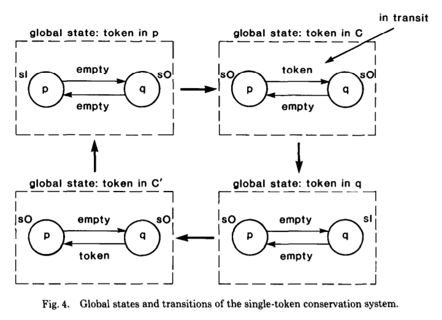

#### Chandy-Lamport
Chandy-Lamporta是分布式一致性快照算法:
在一个分布式计算系统中，为了保证数据的一致性需要对数据进行一致性快照。
Flink和spark在做流失计算的时候都借鉴了chandy-lamport算法的原理，这篇文章就是对chandy-lamport算法原理的详细介绍。

考虑一个分布式计算系统。

其中有两个节点，也就是两个进程，p和q，s0，s1对应的是两个状态。
- token是一个令牌，全局只有一个，进程之间互相发送令牌。
- s0对应的状态就是进程不持有令牌。
- s1对应的状态就是进程持有令牌。
- 两个进程间的连线代表消息队列，token有可能处于消息队列之中

初始情况下两个进程都不拥有令牌，也就是都是s0状态。这个分布式系统就这件循环地传送令牌。

由于进程是可能崩溃的，我们需要保证在进程崩溃重启后，系统仍然能够正常运行，或者说我们要从某个检查点恢复程序的运行状态，
这时就需要将系统在某个时间点的状态保存起来。也就是说我们需要对分布式系统进行一次快照存储，保存每个节点在当时的状态以及每个消息队列在当时的状态。
举个例子，假如在上图右上角的时刻对系统进行一个快照存储，那么对应的状态就是：

|元素|状态|
|---|---|
|p　   |  s0   |
|q	   |  s0   |
|p->q　| token |
|q->o  | empty |

假如程序在此时崩溃了，那么在重启之后，就可以恢复到保存的快照状态继续执行。

可是由于p和q是两个进程，时间不同步，假如p进程在发送token之后进行了快照存储，q进程在p发送token之前进行快照存储，那么就会出现这种情况：
1. p进程保存快照的时候由于p进程已经发送了token，token在q进程的队列中，所以p进程保存快照时认定token不在p进程也不在p进程的接收队列中。
2. q进程保存快照时由于比p进程早一些，此时p进程还没有发送token，因此q进程认定token不在q进程也不在q进程的接收队列中。

这样保存的全局快照里发现token消失不见了。

为了解决这问题，chamdy-lamport算法提出了marker消息的概念：

在上图右上角中：
1. p发送完token后发起一次快照，发送marker给q。
2. q接收到marker消息，保存本地状态，由于队列FIFO，所以q接收marker消息时肯定已经接收到了token，所以q保存自己状态为s1，保存p->q状态为empty
3. 然后q发送marker给p，p接收到marker，检查在p保存状态后有没有收到q的消息，由于没有收到，所以保存q->p队列的状态为空。

到此一轮快照保存结束，全局的状态为：

|元素|状态|
|---|---|
|p　   |  s0   |
|q	   |  s1   |
|p->q　| empty |
|q->o  | empty |

这个全局状态就对应的是上图右下角的状态，此时全局的一致性状态保存成功。

以上只是一个简单的例子，实际上chandy-lamport对算法的正确性有严格的公式推导，感兴趣可以参考https://lamport.azurewebsites.net/pubs/chandy.pdf

#### 算法简述
**前提是要求所有通信channel是FIFO的**（flink也是, 相比之下Google的MillWheel则不需要）
1. 任何节点的snapshot由本地状态snapshot和节点的input channel snapshot组成
2. 任何src可以任意时间决定take本地状态snapshot，take完本地snapshot，广播一个marker给所有下游
3. 任意没有take本地snapshot的节点(注意这个算法里src也是可以接受别人的msg的)，
假设从第x个channel收到第一个marker的时候，take本地状态snapshot(且take接受到第一个marker的input channel-x的channel snapshot为空)，
然后给所有output channel广播这个marker。
4. 从收到第一个marker并take完本地snapshot之后，记录所有input channel的msg到log里，直到从所有的input channel都收到这个marker.
 作为这些input channel的channel snapshot。
 
 > 这个算法和stream的思想很像，当前节点只管当前的状态，发消息和状态也只往下游发

作者：阿莱克西斯
链接：https://zhuanlan.zhihu.com/p/44454670

#### Flink在系统内有环形通信时
的算法套路跟Chandy-Lamport算法几乎一样。
1. 当一个节点是环的msg流动的起点时(或者说这个节点正好同时是环的起点和终点)，它必定有一个input channel是来自自己的downstream节点的。
2. 这个节点不能像其他节点一样，等待所有的input channel的barrier到来，才take snapshot且广播barrier，
因为它有一个或多个input channel的消息是被自己往“下游”发的消息所引发的。
如果它自己不向下游广播barrier，那么这些回环input channel永远也不会有barrier发来，那么算法会永久等待。
3. 所以这个这个节点只需要等待所有非回环input channel的barrier到了，它就知道所有可能的barrier都到齐了，
那么它就可以take本地snapshot且往“下游”广播barrier了（从而造成barrier会通过回路再次抵达这个节点）
4. **重点**: 此节点take完本地snapshot之后，需要记录所有回环input channel的msg到log里，
直到从此回环input channel收到自己发出的barrier，当所有回环input channel都收到barrier-n。
 此时在Step3 take的本地snapshot，加上所有回环input channel的msg log一起，成为此节点在barrier-n的本地snapshot。
5. Failover，failover的时候，除了从本地snapshot恢复状态之外，还需要replay所有input channel的msg。

####  “Exactly once is NOT exactly the same” 
分析了流计算系统中常说的『Exactly Once』特性，主要观点是：『精确一次』并不保证是完全一样。主要内容如下：

1. 背景

– 1.1. 最多一次（At-most-once）

– 1.2. 至少一次（At-least-once）

– 1.3. 精确一次（Exactly-once）

2. 『精确一次』是真正的『精确一次』吗?

3. 分布式快照与至少一次事件传递和重复数据删除的比较

从语义的角度来看，分布式快照和至少一次事件传递以及重复数据删除机制都提供了相同的保证。然而，由于两种机制之间的实现差异，存在显着的性能差异。

**机制 1（分布式快照 / 状态检查点）的性能开销是最小的**，因为引擎实际上是往流应用程序中的所有算子一起发送常规事件和特殊事件，
而状态检查点可以在后台异步执行。但是，对于大型流应用程序，故障可能会更频繁地发生，导致引擎需要暂停应用程序并回滚所有算子的状态，
这反过来又会影响性能。流式应用程序越大，故障发生的可能性就越大，因此也越频繁，反过来，流式应用程序的性能受到的影响也就越大。
然而，这种机制是非侵入性的，运行时需要的额外资源影响很小。

**机制 2（至少一次事件传递加重复数据删除）可能需要更多资源，尤其是存储**。使用此机制，引擎需要能够跟踪每个算子实例已完全处理的每个元组，
以执行重复数据删除，以及为每个事件执行重复数据删除本身。这意味着需要跟踪大量的数据，尤其是在流应用程序很大或者有许多应用程序在运行的情况下。
执行重复数据删除的每个算子上的每个事件都会产生性能开销。但是，使用这种机制，流应用程序的性能不太可能受到应用程序大小的影响。
- 对于机制 1，如果任何算子发生故障，则需要发生全局暂停和状态回滚；
- 对于机制 2，失败的影响更加局部性。当在算子中发生故障时，可能尚未完全处理的事件仅从上游源重放/重传。
性能影响与流应用程序中发生故障的位置是隔离的，并且对流应用程序中其他算子的性能几乎没有影响。

从性能角度来看，这两种机制的优缺点如下。

分布式快照优点： 
– 较小的性能和资源开销

分布式快照缺点：
– 对性能的影响较大
– 拓扑越大，对性能的潜在影响越大

至少一次事件传递以及重复数据删除机制的优缺点：

优点： 
– 故障对性能的影响是局部的
– 故障的影响不一定会随着拓扑的大小而增加

缺点：
– 可能需要大量的存储和基础设施来支持
– 每个算子的每个事件的性能开销

虽然从理论上讲，**分布式快照和至少一次事件传递加重复数据删除机制之间存在差异，但两者都可以简化为至少一次处理加幂等性**。
对于这两种机制，当发生故障时(至少实现一次)，事件将被重放/重传，并且通过状态回滚或事件重复数据删除，算子在更新内部管理状态时本质上是幂等的。